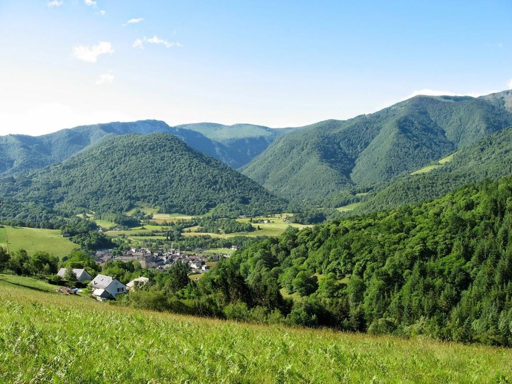
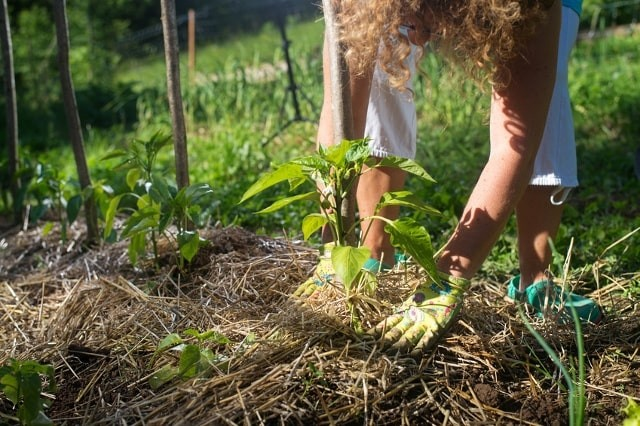

**Coccinelle & Libellule** est situé porche de Tarbes (30mn) et de Bagnères de Bigorre (15mn).
C'est un bel endroit pour découvrir les beautés de la nature environnante (montagnes, lacs, forêts....) mais
aussil les cités réputées tant au niveau thermal qu'historique.

La gastronomie est un autre autout de notre belle région (fromages, croustade, charcuteries, porcs noirs de
Bigorre, garbure....)

**Coccinelle & Libellule**, c'est également un lieu crée autour d'une philosophie de sobriété heureuse,
situé en pleine nature, qui vous attend.

Nous souhaitons créer du lien social au plus près de notre territoire. Les équipements sont écologiques,
(matériaux de construction, énergies renouvelables, récupération des eaux de pluie, plantations sans
traitement et en agroécologie ou permaculture).

Vous y trouverez un éco-camping rural (6 emplacements) ouvert à la belle saison.

Des stages, ateliers conférences, débats.... sont organisés de l'automne au printemps.

## A propos de moi

* **Apiculture**: apicultrice depuis mes 17 ans, j'ai travaillé pour des apiculteurs professionnels
avant de préférer me consacrer à cette passion en tant qu'"amateur" ( du verbe aimer), au  plus loin d'un shéma productiviste.

* **Agro-écologie**: permaculture, après une carrière consacrée à l'agriculture (dans le domaine animal), mes convictions en la matière m'ont poussé à chercher des alternatives à l'agriculture productiviste défendue par les lobbyistes agricoles et soutenue par la Politique Agricole Commune (PAC).
Des moyens de produire au plus près des consommateurs et en respectant l'environnement dont nous faisons partie intégrante existent et  peuvent être soutenus.

* vivre en milieu rural, en **sobrité heureuse**.
